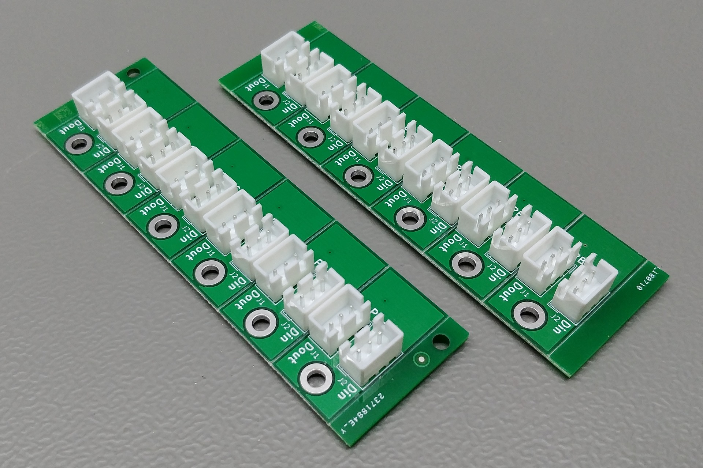
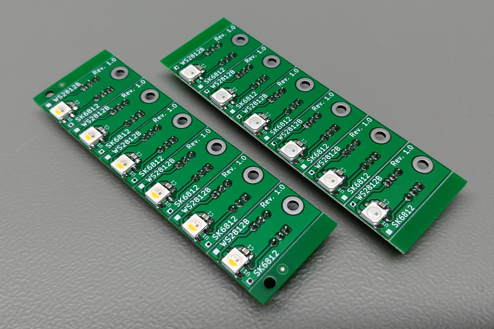

# Addressable LED Board - Rev. 1.0

This is a small board for the WS2812B RGB and SK6812 RGBW LEDs. These two types of LEDs are pin compatible.

## BOM

| Identifiers | Quantity | Part |
| --- | --- | --- |
| C1 | 1x | 0805 Ceramic capacitor, 100nF |
| J1, J2 | 2x | JST XH connector, 2.5mm pitch, 3 way, through-hole |
| U1 | 1x | WS2812B _or_ SK6812 5050 LED |